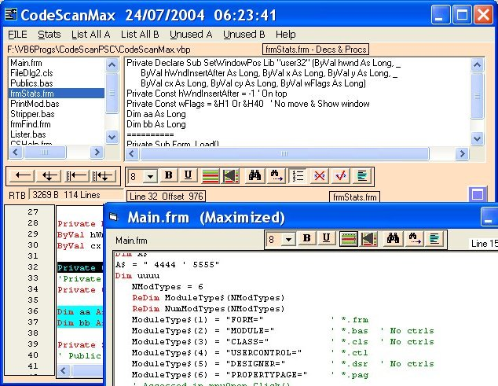



## CodeScanMax\(Update 6 Nov\)

### Description

CodeScanMax(Update 6 Nov) by Robert Rayment. (Work around for forms with no code, addess some differences between Win98 & WinXP RichTB versions when setting Fonts & Coloring) .... This program is intended to give info on declarations and procedures used in a project. Also to display some items within procedures and a variety of unused items. To be most useful the exe can be placed on the Office toolbar or the Taskbar. It can then analyse the current project provided it is saved to disk. It is non-intrusive A second use is to copy/paste code from any other project while in the IDE. Please read limitations in the help file. I've deliberately left some unused junk in the program so you can see how it works straightaway. It's 'horses for courses' CodeScan suits me but try these others if you haven't already, they may be closer to what you want -- Code Fixer v2.2.9 Roger Gilchrist(Ulli) CodeId=53297 -- Deeplook v4.7 Dean Camera CodeId=54836 -- Code Statistics/.. v4.3 E O'Sullivan CodeID=39149 or later versions.-- Fast RTB Coloring Will Barden CodeId=39824.-- Back highlighting buggy CodeId=43509 (Tested on Win98 & WinXP, Zip 57KB).
 
### More Info
 
vbp files

just run

display

             |
---                |---
**Submitted On**   |2004-08-01 10:16:22
**By**             |[Robert Rayment](https://github.com/Planet-Source-Code/PSCIndex/blob/master/ByAuthor/robert-rayment.md)
**Level**          |Intermediate
**User Rating**    |5.0 (45 globes from 9 users)
**Compatibility**  |VB 6\.0
**Category**       |[Complete Applications](https://github.com/Planet-Source-Code/PSCIndex/blob/master/ByCategory/complete-applications__1-27.md)
**World**          |[Visual Basic](https://github.com/Planet-Source-Code/PSCIndex/blob/master/ByWorld/visual-basic.md)
**Archive File**   |[CodeScanMa1814891162004\.zip](https://github.com/Planet-Source-Code/robert-rayment-codescanmax-update-6-nov__1-54910/archive/master.zip)

### API Declarations

see code

